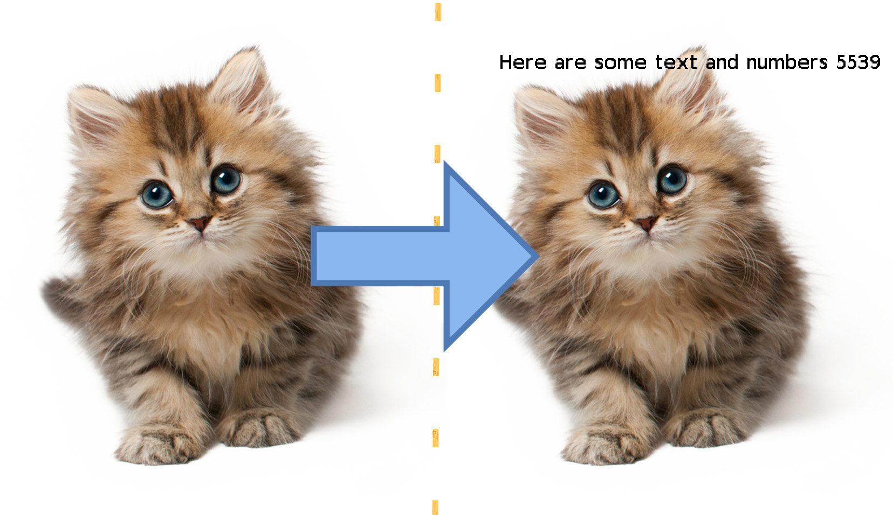

**This repo has been moved to [Gitlab](https://gitlab.com/rdi-eg/text_on_image) and is no longer maintained here.**

# text_on_image



A small header file that helps you write text on images.
It supports:
* Letters (upper/lowercase)
* Numbers
* Spaces.

Does **not** support any symbols.

It could be helpful for debugging and stuff.
It uses [stb_image_resize](https://github.com/nothings/stb/blob/master/stb_image_resize.h) under the hood to get you the desired size of text.

# Usage
* Needs c++14 or newer.
* Drop the `rdi_text_on_image.h` into your project and include it.
* You must define RDI_TEXT_ON_IMAGE_IMPLEMENTATION somewhere before you include it.

### nuff talking, let's learn with an example:
```c++
#define STB_IMAGE_IMPLEMENTATION
#define STB_IMAGE_WRITE_IMPLEMENTATION
#include "stb_image.h"
#include "stb_image_write.h"

#define RDI_TEXT_ON_IMAGE_IMPLEMENTATION
#include "rdi_text_on_image.h"

int main()
{
  int height, width, channels;
  std::uint8_t* image_data = stbi_load("../test/kitten_png_image.png", &width, &height, &channels, 0);

  RDI::Public::Image image{
	image_data, // pixels array
	(size_t)channels, // number of channels
	(size_t)width, // input image width
	(size_t)height // input image height
  };

  RDI::Public::Text text{
	"Here are some text and numbers 5539", // text you'd like to display
	42, // size
	100, // x coordinate
	100 // y coordinate as to where you'd like the text to be displayed on the image
  };

  // WARNING: this function changes the pixels in the image that you've passed
  RDI::Public::write_text_on_image(image, text);

  stbi_write_png("../kitten_png_image.png", width, height, channels, image_data, 0);

  stbi_image_free(image_data);
}

```

I'm using `stb_image` to load the image. Maybe you use something else, that's okay but 
the byte stream needs to be a one dimentional array of `char` or `std::uint8_t` in the form of `rgbrgbrgb... etc`
where `r`, `g` and `b` are red, green and blue 0 to 255 values respectively.
or if it's a single channel then `ppppp...` where `p` is the pixel value from 0 to 255.

### WARNING
`RDI::Public::write_text_on_image` changes the pixels in the image that you've passed.
If you'd like to preserve the original image, take a copy before sending it to this function.

# Contributing
Well you'll have to understand the code. 

* The first part of the header are decalaration.
* And then there is the implementation of stb_image_resize (I copied the whole thing and pasted it in).
* After that you'll find a map called `char_to_pixels` which as the name implies, maps each character to the pixels that form it.
* There's the `make_text_overlay` function which takes the text and creates an image overlay out of it using the `char_to_pixels` map.
* lastly `write_text_on_image` which the user actually calls. It basically calls `make_text_overlay`, resizes the text_overlay image and then applies it.
